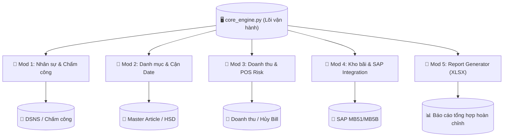

# 📑 TÀI LIỆU XÂY DỰNG HỆ THỐNG TỔNG HỢP KIỂM SOÁT (PYTHON TOOL)

> **Mã Dự án:** WCM_AUDIT_PYTHON  
> **Nền tảng chuyển đổi:** VBA Binary Excel (.xlsb) -> Python Automation Suite  
> **Tác giả:** Antigravity AI Developer & User  
> **Phiên bản tài liệu:** v1.0.0  
> **Ngày khởi tạo:** 14/05/2026  

---

## 🏁 1. TỔNG QUAN DỰ ÁN (PROJECT OVERVIEW)

### 1.1. Mục tiêu Dự án
Dự án nhằm chuyển hóa toàn bộ hệ thống tự động hóa kiểm soát nội bộ (Audit Core) được code bằng VBA trong file `Tool check tổng hợp V3.53_1.xlsb` sang một giải pháp **Python thuần túy**. 
Mục tiêu cụ thể bao gồm:
*   **Hiệu năng:** Tăng tốc độ xử lý hàng trăm nghìn dòng dữ liệu (sử dụng `Pandas` thay vì cơ chế lặp Row-by-Row của VBA).
*   **Tin cậy:** Khắc phục tình trạng treo Excel khi tải báo cáo API BluePOS dung lượng lớn.
*   **Kiến trúc:** Chia nhỏ dự án thành các mô-đun Python độc lập, dễ bảo trì, mở rộng và kết nối với các API tương lai.
*   **Bảo mật:** Quản lý Token, tài khoản mật khẩu SAP/POS qua file cấu hình `.env` an toàn hơn hardcode trong VBA.

### 1.2. Sơ đồ Kiến trúc Mô-đun Hóa (Modular Architecture)

Hệ thống được thiết kế theo mô hình **Loose Coupling (Khớp nối lỏng)**, các mô-đun chạy độc lập và giao tiếp thông qua dữ liệu chuẩn hóa (DataFrame/CSV/JSON):



---

## 📘 2. TÀI LIỆU KỸ THUẬT CHI TIẾT TỪNG MÔ-ĐUN (MODULE SPECS)

*Ghi chú: Phần này sẽ được cập nhật chi tiết hóa (Deep-Dive) sau mỗi phiên thảo luận của từng Mô-đun.*

### 📦 MÔ-ĐUN 1: NHÂN SỰ & HIỆN DIỆN CỬA HÀNG (MOD_HR)
*   **Trạng thái:** ⏳ Đang chờ triển khai (Phiên thảo luận 1)
*   **File code dự kiến:** `mod_hr_check.py`
*   **Các Sheet liên quan:** `DSNS`, `Storelist`, `Chấm công`.
*   **Mô tả chức năng cốt lõi:**
    *   Lọc và làm sạch danh sách nhân sự theo Cửa hàng (CH).
    *   Ánh xạ địa chỉ cửa hàng, tọa độ kinh/vĩ độ để tính toán hiện diện.
    *   **Thuật toán trọng yếu:** `checkDupImei` - Quét log chấm công để phát hiện hành vi gian lận (1 thiết bị IMEI chấm công hộ cho nhiều nhân sự hoặc tọa độ không khớp).
*   **Dữ liệu Đầu ra:** Bảng báo cáo nhân sự vi phạm/bất thường chấm công.

### 📦 MÔ-ĐUN 2: DANH MỤC & KIỂM SOÁT HẠN DÙNG (MOD_CATALOG)
*   **Trạng thái:** ⏳ Đang chờ triển khai
*   **File code dự kiến:** `mod_catalog_date.py`
*   **Các Sheet liên quan:** `Master article`, `HSDlist`.
*   **Mô tả chức năng cốt lõi:**
    *   Quản lý danh mục sản phẩm khổng lồ (>80,000 dòng), tối ưu bộ nhớ truy vấn.
    *   **Thuật toán trọng yếu:** Cảnh báo cận hạn sử dụng đối với nhóm Fresh Food (Hàng tươi sống) dựa trên cấu trúc ngày nhập và thời hạn sử dụng mục tiêu.

### 📦 MÔ-ĐUN 3: DOANH THU & RỦI RO THANH TOÁN (MOD_POS)
*   **Trạng thái:** ⏳ Đang chờ triển khai
*   **File code dự kiến:** `mod_pos_engine.py`
*   **Các Sheet liên quan:** `Doanh thu chi tiết`, `Hình thức thanh toán`, `Hủy dòng`, `Hủy giao dịch`, `Treo bill`.
*   **Mô tả chức năng cốt lõi:**
    *   Giao tiếp tự động (HTTP Client) lấy dữ liệu báo cáo từ BluePOS.
    *   **Thuật toán trọng yếu:** 
        *   Phát hiện lạm dụng Coupon giảm giá cao (`filter_coupon70`).
        *   Cảnh báo giao dịch quẹt thẻ lớn đáng ngờ (`filter_card10tr`).
        *   Phân tích lịch sử hủy dòng/hủy bill của thu ngân.

### 📦 MÔ-ĐUN 4: KHO BÃI & TÍCH HỢP SAP ERP (MOD_SAP)
*   **Trạng thái:** ⏳ Đang chờ triển khai
*   **File code dự kiến:** `mod_sap_robot.py`
*   **Các Sheet liên quan:** `MB51`, `Stock`, `Negative stock`, `Shrinkage`, `MI24`, `MB5B`.
*   **Mô tả chức năng cốt lõi:**
    *   Sử dụng `win32com.client` kết nối SAP GUI Scripting API tự động đăng nhập và tải báo cáo MB51, MB5B.
    *   **Thuật toán trọng yếu:** Cảnh báo Tồn âm (Negative Stock), Tồn ảo (Fake Stock) và Hủy phiếu nhập hàng (Reverse MVT 102).

### 📦 MÔ-ĐUN 5: TỔNG HỢP BÁO CÁO CUỐI CÙNG (MOD_REPORT)
*   **Trạng thái:** ⏳ Đang chờ triển khai
*   **File code dự kiến:** `report_generator.py`
*   **Các Sheet liên quan:** `UI`, `Data for report`, `Chỉ số kinh doanh`, `Report`.
*   **Mô tả chức năng cốt lõi:**
    *   Tập hợp kết quả từ cả 4 mô-đun trên.
    *   Dùng `XlsxWriter` hoặc `OpenPyXL` để xuất file Excel báo cáo chuyên nghiệp, tự động highlight dòng đỏ (cảnh báo nguy cơ cao) và vẽ biểu đồ dashboard tóm tắt.

---

## 🛠️ 3. HƯỚNG DẪN CÀI ĐẶT & TRIỂN KHAI (DEVELOPMENT GUIDE)

### 3.1. Khởi tạo môi trường (Virtual Environment)
Môi trường ảo đã được thiết lập thành công tại thư mục dự án: `D:\Dự án AI\venv`.

### 3.2. Danh sách thư viện Python yêu cầu (Requirements)
Hệ thống tận dụng các thư viện sau:
*   `pandas` (xử lý bảng dữ liệu lớn).
*   `pyxlsb` (đọc trực tiếp file nhị phân `.xlsb` tốc độ cao).
*   `requests` / `httpx` (giao tiếp API BluePOS/Ops).
*   `pywin32` (tự động hóa SAP GUI trên hệ điều hành Windows - *cần cài đặt bổ sung*).
*   `openpyxl` / `XlsxWriter` (xuất báo cáo định dạng Excel đẹp mắt).

Lệnh cài đặt thư viện mở rộng:
```powershell
..\venv\Scripts\python.exe -m pip install pandas pyxlsb requests openpyxl XlsxWriter pywin32
```

---

## 🏷️ 4. CHÍNH SÁCH QUẢN LÝ PHIÊN BẢN (VERSIONING POLICY)

Hệ thống áp dụng chuẩn **Semantic Versioning (vX.Y.Z)**:
*   **X (Major):** Thay đổi kiến trúc hệ thống lớn, phá vỡ cấu trúc cũ (ví dụ: Ghép thành công toàn bộ mô-đun -> v1.0.0).
*   **Y (Minor):** Hoàn thành thêm mới một Mô-đun nghiệp vụ độc lập hoặc tính năng mới (ví dụ: Xong Module 1 -> v0.1.0).
*   **Z (Patch):** Sửa lỗi thuật toán nhỏ, cập nhật tiêu đề bảng dữ liệu (ví dụ: Sửa lỗi format ngày tháng -> v0.1.1).

---

## 📜 5. NHẬT KÝ THAY ĐỔI & LỊCH SỬ SỬA ĐỔI (CHANGELOG AUDIT LOG)

*Bảng dưới đây ghi lại lịch sử mọi thay đổi, yêu cầu nghiệp vụ và tóm tắt sửa đổi. Luôn cập nhật bảng này ngay khi kết thúc một turn chỉnh sửa.*

| Phiên bản | Ngày thực hiện | Tác giả | Yêu cầu chi tiết từ User | File thay đổi | Tóm tắt chi tiết sửa đổi |
| :--- | :--- | :--- | :--- | :--- | :--- |
| **v0.0.1** | 14/05/2026 | Antigravity AI | Khởi tạo cấu trúc dự án ban đầu và viết tài liệu hướng dẫn, phân tách mô-đun theo lộ trình | `BUILD_DOC.md` | Khởi tạo file Master Documentation quy định cấu trúc 5 Mô-đun, Sơ đồ luồng dữ liệu và chính sách Versioning |
| | | | | | |

---
*Tài liệu được cập nhật lần cuối vào: 14/05/2026 lúc 11:42:00*
